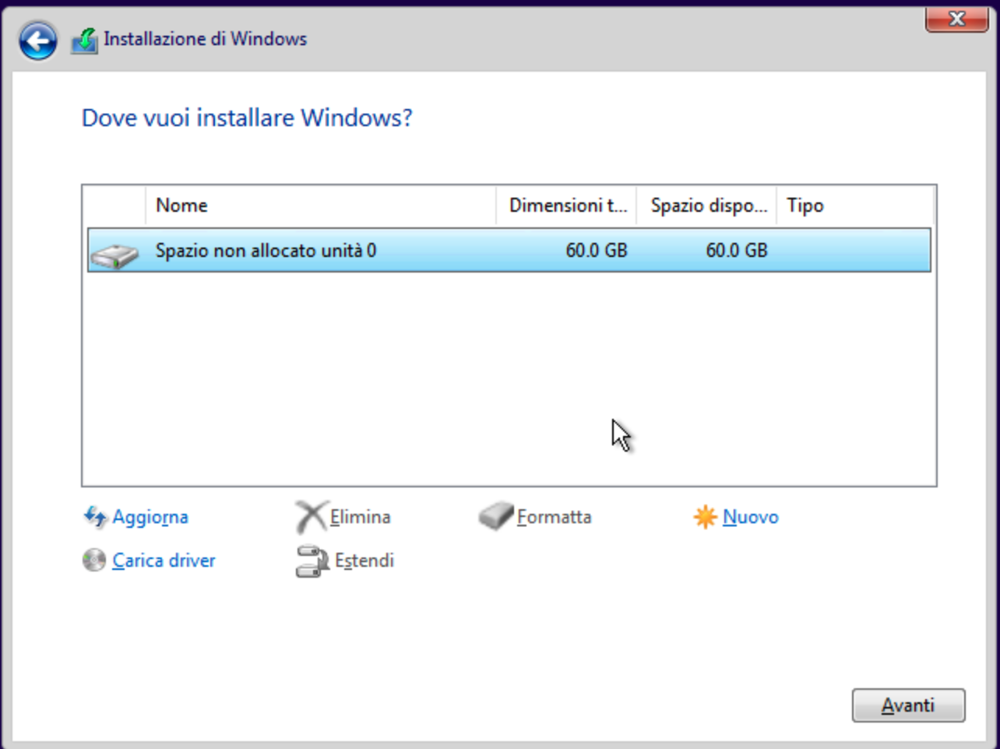

# Proxmox automated Windows setup for FlareVM

## Overview
This script automates the process of creating a Windows virtual machine on Proxmox, complete with custom configurations and driver installations, making it ready for [FlareVM](https://github.com/mandiant/flare-vm). The script mounts a Windows ISO, customizes it with `autounattend.xml` for a smooth installation, and sets up necessary VirtIO drivers for optimal performance in a Proxmox environment. Following VM creation, you’ll be able to complete the FlareVM installation with the provided PowerShell script.

## Requirements
- **Git** installed on your Proxmox node
- **Internet connection** – Internet access is necessary for script downloads during the FlareVM setup, and it is a fundamental requirement for FlareVM’s installation process.
- **Windows 10 Official ISO** in the same directory as the other repository files. You can find the iso image at https://www.microsoft.com/en-gb/software-download/windows10iso or https://os.click/.
- **Patience & Coffee** ☕️ – This process will take some time!

### Steps
1. **Clone the repository** to get all necessary files.
Clone the repository using the following command:

```bash
git clone https://github.com/flavioscg/proxmox-automated-flarevm.git
```

Navigate into the project directory:

```bash
cd Proxmox-automated-flarevm
```

Set the correct execution permissions for the `start.sh` script:

```bash
chmod +x start.sh
```

2. **Run the script and answer the prompts**:
```bash
./start.sh
```
> The script will ask for the ISO name, VM ID, RAM, cores, and disk size. **Note**: At least 60 GB is required to meet FlareVM's needs.

3. **Go to the created and started VM, you should be presented with the disk selection screen**. You won't see any disk because you need to load the VirtIO drivers first. Click **Load**, then **OK**, and select the VirtIO drivers.

   

   If you don't see any drivers, try clicking **Rescan**.

4. **Choose the available disk** created in the initial configuration and start the Windows installation.

   

5. **Continue with the installation** and wait for the process to complete. Once done, you will find the `install-flarevm.ps1` script on the desktop.

6. **Run the post-installation**
   - Open PowerShell as Administrator
     

   - Move to the Desktop directory
     ```powershell
     cd Desktop
     ```
   - Run the pre-FlareVM script:
     ```powershell
     .\pre-flarevm.ps1
     ```

   The script will disable **Antimalware** and **Windows Update**, and then launch the FlareVM installation. Follow the on-screen instructions.

7. **Final Snapshot**: Create a snapshot of the VM for future restores. ⚠️

### Useful links:
- [FlareVM GitHub](https://github.com/mandiant/flare-vm)

This script provides an efficient, hands-off installation, simplifying the initial Windows and FlareVM setup process for Proxmox VMs.